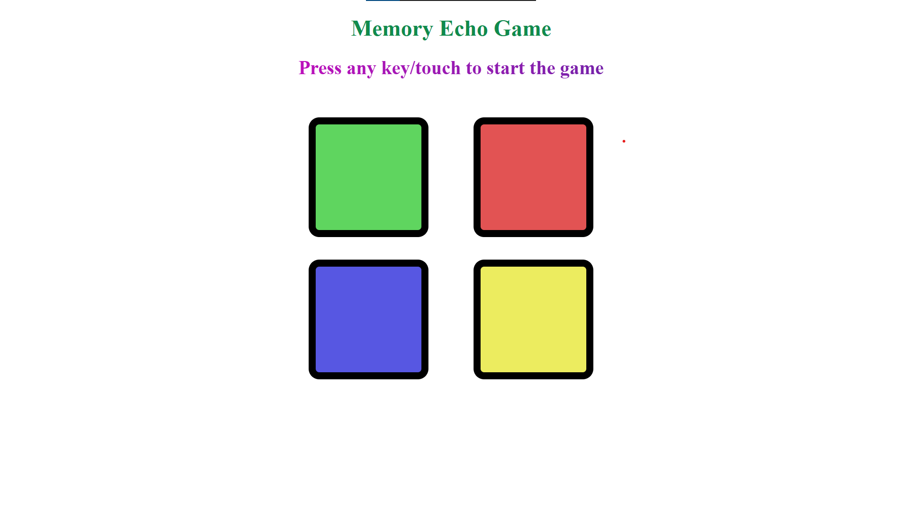
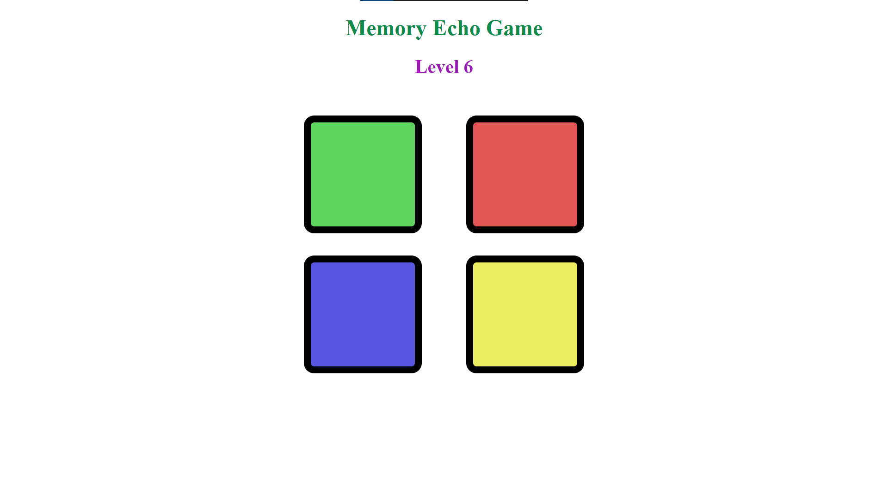
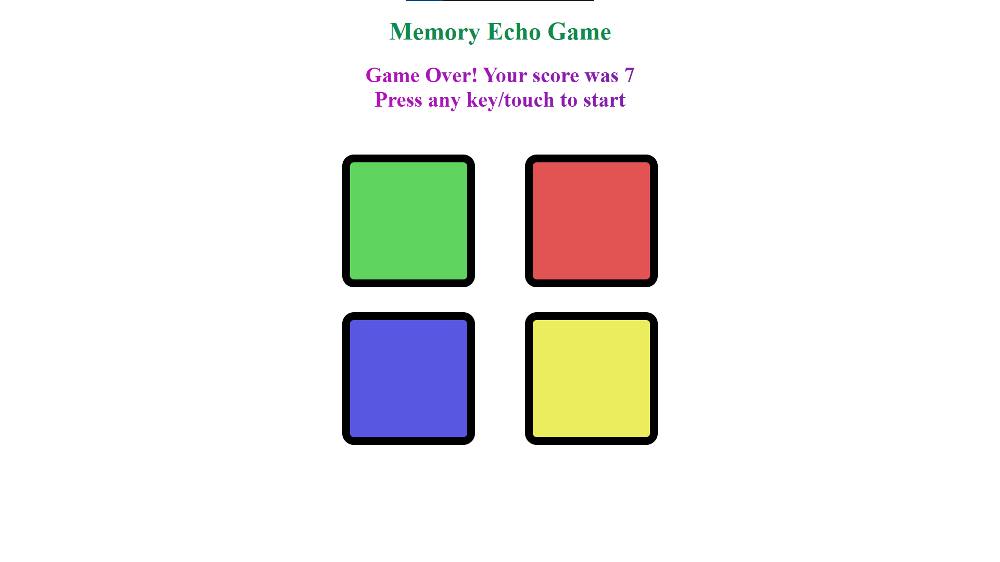

<h1 align="center" style="color: #ff00cc;">
  🎮 MEMORY ECHO
</h1>

  <em>A colorful memory challenge to test your brainpower!</em>  

  

---

## ✨ Features

- 🌈 **Neon Color Patterns** – Watch and repeat glowing sequences
- 🧠 **Brain Workout** – Improves memory & focus
- 📱 **Mobile-Ready** – Works on tap and click
- 🚀 **Progressive Challenge** – Gets harder with each level

---

## 🎮 Game Screenshots

  
  
  

---

## 🕹️ How to Play

1. **Start the Game**  
   - Desktop: Press any key  
   - Mobile: Tap anywhere  

2. **Watch the Sequence**  
   - Colors will flash in a specific order  

3. **Repeat the Sequence**  
   - Click/tap the buttons in the same order  

4. **Level Up**  
   - Every correct round adds a new color to the sequence  

---

## 🔧 Installation

Run this command to clone the repository:  
`git clone https://github.com/yourusername/memory-echo.git`

Then open `index.html` in your browser and start playing! 🎮

Play game - https://piyuscoder.github.io/Memory-Echo-Game/

## 🌌 Tech Stack

- **HTML5** – Game structure  
- **CSS3** – Styling  
- **JavaScript** – Game logic

  

## 📜 License
Licensed under the MIT License.

